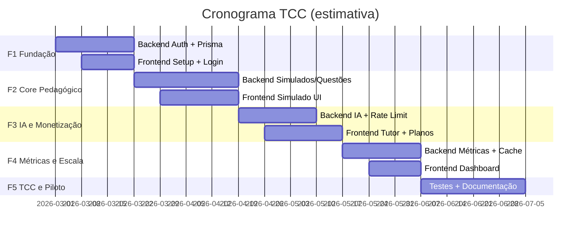

# Cronograma de Implementação — Backend e Frontend

> Roadmap do TCC em **5 fases**. Cada fase tem entregáveis claros, dependências e estimativa de duração para estudante em tempo parcial (~10–15h/semana).

**Conceitos detalhados:** [CONCEITOS-SEGURANCA-E-PERFORMANCE.md](./CONCEITOS-SEGURANCA-E-PERFORMANCE.md)

---

## Visão geral



| Fase | Nome | Duração estimada | Marco |
|------|------|------------------|-------|
| **F1** | Fundação | 3–4 semanas | Aluno faz login e vê perfil |
| **F2** | Core pedagógico | 4–5 semanas | Aluno faz simulado completo |
| **F3** | IA e monetização | 3–4 semanas | Tutor IA + planos funcionando |
| **F4** | Métricas e escala | 3 semanas | Dashboard + piloto em escola |
| **F5** | Entrega TCC | 3–4 semanas | Monografia + apresentação |

---

## Estado atual do projeto (baseline)

### ✅ Já feito (Backend)

- [x] Estrutura hexagonal por módulos
- [x] Entidades `Usuario`, `PerfilAluno`
- [x] Ports: `UsuariosRepositoryPort`, `OAuthServicePort`, `AuthTokenServicePort`
- [x] `LoginGoogleUseCase` (lógica)
- [x] Prisma + schema otimizado (6 tabelas)
- [x] Migration inicial SQL
- [x] `PrismaService` + `PrismaModule`
- [x] `PrismaUsuariosRepository` (adapter)

### ⬜ Pendente imediato

- [ ] Aplicar migration no Railway (`prisma migrate deploy`)
- [ ] Adapters: `GoogleOAuthService`, `JwtAuthTokenService`
- [ ] `UsuariosController` + DTO com validação
- [ ] Frontend (apps/web ainda não criado)

---

## FASE 1 — Fundação (Semanas 1–4)

**Objetivo:** Autenticação ponta a ponta. Aluno entra com Google e recebe JWT.

### Backend

| # | Tarefa | Conceitos | Arquivos principais |
|---|--------|-----------|---------------------|
| 1.1 | Aplicar migration no Railway | Transações, Least privilege | `prisma/migrations/` |
| 1.2 | Adapter `GoogleOAuthService` | OAuth2 | `adapters/out/google-oauth.service.ts` |
| 1.3 | Adapter `JwtAuthTokenService` | JWT | `adapters/out/jwt-auth-token.service.ts` |
| 1.4 | Completar `UsuariosController` | DTO, validação | `usuarios.controller.ts`, `login-google.dto.ts` |
| 1.5 | `JwtAuthGuard` + decorator `@CurrentUser()` | JWT, RBAC (base) | `infrastructure/auth/` |
| 1.6 | `AtualizarPerfilUseCase` + endpoint | DI, Ports | `atualizar-perfil.use-case.ts` |
| 1.7 | Exceções de domínio + filter global | Tratamento de erros | `domain/exceptions/`, `http-exception.filter.ts` |
| 1.8 | Configurar CORS no `main.ts` | CORS | `main.ts` |

**Entregável F1 Backend:** `POST /usuarios/login-google` e `PATCH /usuarios/perfil` funcionando com JWT.

### Frontend

| # | Tarefa | Conceitos | Arquivos principais |
|---|--------|-----------|---------------------|
| 1.9 | Criar `apps/web` (Next.js App Router) | — | `apps/web/` |
| 1.10 | Tailwind + Shadcn UI setup | — | `components/ui/` |
| 1.11 | Tela de Login com Google | OAuth2 | `app/login/page.tsx` |
| 1.12 | Cliente API (`lib/api.ts`) | JWT | `fetch` com Bearer token |
| 1.13 | Middleware de auth Next.js | JWT | `middleware.ts` |
| 1.14 | Página de onboarding (perfil aluno) | — | `app/onboarding/page.tsx` |
| 1.15 | Layout autenticado (sidebar/header) | RBAC (visual) | `app/(dashboard)/layout.tsx` |

**Entregável F1 Frontend:** Login → onboarding → home vazia autenticada.

### Dependências entre tarefas

```
1.1 → 1.2, 1.3 → 1.4 → 1.5 → 1.6
1.4 → 1.11 → 1.12 → 1.13 → 1.14
```

---

## FASE 2 — Core pedagógico (Semanas 5–9)

**Objetivo:** Banco de questões, simulados adaptativos, envio de respostas.

### Backend

| # | Tarefa | Conceitos | Arquivos principais |
|---|--------|-----------|---------------------|
| 2.1 | Schema Prisma: `questoes`, `simulados`, `respostas_simulado` | Índices, unique constraints | `schema.prisma` + migration |
| 2.2 | Entidade `Questao` + regras | Domínio puro | `questao.entity.ts` |
| 2.3 | Entidade `Simulado` + estados | Domínio | `simulado.entity.ts` |
| 2.4 | `QuestoesRepositoryPort` + Adapter Prisma | Hexagonal | `prisma-questoes.repository.ts` |
| 2.5 | `BuscarQuestoesFiltroUseCase` | Paginação cursor | `buscar-questoes-filtro.use-case.ts` |
| 2.6 | `GerarSimuladoUseCase` (algoritmo adaptativo v1) | Regra de negócio | `gerar-simulado.use-case.ts` |
| 2.7 | `EnviarRespostaUseCase` | Idempotência, transações | `enviar-resposta.use-case.ts` |
| 2.8 | `IdempotencyServicePort` + Adapter | Idempotência | `prisma-idempotency.service.ts` |
| 2.9 | Interceptor `IdempotencyInterceptor` | Idempotência | `infrastructure/http/interceptors/` |
| 2.10 | Correlation ID middleware | Correlation ID | `correlation-id.middleware.ts` |
| 2.11 | Seed de questões ENEM (script) | — | `prisma/seed.ts` |

**Entregável F2 Backend:** CRUD simulado + enviar resposta idempotente.

### Frontend

| # | Tarefa | Conceitos | Arquivos principais |
|---|--------|-----------|---------------------|
| 2.12 | Tela "Novo Simulado" (filtro área/dificuldade) | — | `app/simulados/novo/page.tsx` |
| 2.13 | Tela de questão (alternativas A–E) | Idempotency-Key no header | `app/simulados/[id]/page.tsx` |
| 2.14 | Timer de simulado | — | componente `SimuladoTimer` |
| 2.15 | Tela de resultado (acertos/erros) | — | `app/simulados/[id]/resultado/page.tsx` |
| 2.16 | Histórico de simulados | Paginação | `app/simulados/page.tsx` |
| 2.17 | Estados de loading/erro globais | Tratamento de erros | `components/ErrorBoundary` |

**Entregável F2 Frontend:** Fluxo completo simulado sem IA.

---

## FASE 3 — IA e monetização (Semanas 10–13)

**Objetivo:** Tutor Gemini com rate limit; planos freemium via Mercado Pago.

### Backend

| # | Tarefa | Conceitos | Arquivos principais |
|---|--------|-----------|---------------------|
| 3.1 | `RedisService` + `CacheServicePort` | Cache-aside | `infrastructure/cache/` |
| 3.2 | `RateLimitServicePort` + Adapter | Rate limiting | `uso_tokens_ia` + Redis |
| 3.3 | `IaEnginePort` + `GeminiIaEngine` | Circuit breaker | `adapters/out/gemini-ia.engine.ts` |
| 3.4 | `ExplicarErroUseCase` | Rate limit + idempotência | `explicar-erro.use-case.ts` |
| 3.5 | `GerarPdfResumoUseCase` (opcional v1) | Rate limit | `gerar-pdf-resumo.use-case.ts` |
| 3.6 | Guard `RateLimitGuard` no ia-tutor | Rate limiting | `rate-limit.guard.ts` |
| 3.7 | `PagamentoServicePort` + Mercado Pago | Webhooks, idempotência | `adapters/out/mercadopago.service.ts` |
| 3.8 | Webhook `POST /webhooks/mercadopago` | Webhooks seguros | `webhooks.controller.ts` |
| 3.9 | `AtivarPlanoUseCase` | Transações | atualiza `planos_assinatura` |
| 3.10 | Endpoint `GET /usuarios/plano` | — | tokens restantes |

**Entregável F3 Backend:** Tutor IA com limite diário; upgrade de plano via Mercado Pago.

### Frontend

| # | Tarefa | Conceitos | Arquivos principais |
|---|--------|-----------|---------------------|
| 3.11 | Botão "Explicar erro" pós-simulado | Rate limit UX | componente na tela de resultado |
| 3.12 | Chat/modal do tutor IA | — | `components/TutorIaPanel.tsx` |
| 3.13 | Indicador "Tokens IA restantes" | Rate limit visual | `components/TokenBadge.tsx` |
| 3.14 | Página de planos (Gratuito vs Apoio) | — | `app/planos/page.tsx` |
| 3.15 | Checkout Mercado Pago | Webhook (aguardar confirmação) | `app/planos/checkout/page.tsx` |
| 3.16 | Polling ou toast pós-pagamento | — | feedback de ativação |

**Entregável F3 Frontend:** Aluno usa tutor IA; pode assinar plano de apoio.

---

## FASE 4 — Métricas e escala (Semanas 14–16)

**Objetivo:** Dashboard de proficiência performático; preparação para piloto em escolas.

### Backend

| # | Tarefa | Conceitos | Arquivos principais |
|---|--------|-----------|---------------------|
| 4.1 | `CalcularProficienciaUseCase` | Agregações pré-calculadas | atualiza `proficiencias_area` |
| 4.2 | Hook pós-resposta (chamar cálculo) | Transações | dentro de `EnviarRespostaUseCase` |
| 4.3 | `ProficienciaRepositoryPort` + cache Redis | Cache-aside | adapter com cache |
| 4.4 | `GET /metricas/proficiencia` | — | `metricas.controller.ts` |
| 4.5 | `GET /metricas/evolucao` (série temporal) | Paginação | query otimizada |
| 4.6 | Audit log em ações sensíveis | Audit log | tabela `audit_logs` + migration |
| 4.7 | Soft delete em usuários | LGPD | campo `deleted_at` |
| 4.8 | Helmet + rate limit global (`@nestjs/throttler`) | Segurança | `main.ts` |
| 4.9 | Health check `GET /health` | — | Railway monitoring |
| 4.10 | Teste de carga (k6 ou Artillery) | Performance | `tests/load/` |

**Entregável F4 Backend:** API aguenta 50+ alunos simultâneos; métricas em < 200ms com cache.

### Frontend

| # | Tarefa | Conceitos | Arquivos principais |
|---|--------|-----------|---------------------|
| 4.11 | Dashboard de proficiência (gráfico radar/bar) | — | `app/dashboard/page.tsx` |
| 4.12 | Gráfico de evolução temporal | — | Recharts ou Chart.js |
| 4.13 | Página "Minha trilha" (áreas fracas) | — | `app/trilha/page.tsx` |
| 4.14 | Painel professor (lista turma) — se houver tempo | RBAC | `app/professor/page.tsx` |
| 4.15 | Responsividade mobile | Acessibilidade | testes em celular |
| 4.16 | PWA básico (opcional) | Inclusão digital | `manifest.json` |

**Entregável F4 Frontend:** Aluno vê onde está forte/fraco; pronto para piloto.

---

## FASE 5 — Entrega TCC (Semanas 17–20)

**Objetivo:** Documentação acadêmica, testes, deploy estável, apresentação.

| # | Tarefa | Backend | Frontend |
|---|--------|---------|----------|
| 5.1 | Testes unitários use cases críticos | Jest | — |
| 5.2 | Testes e2e fluxo login + simulado | Supertest | Playwright (opcional) |
| 5.3 | Deploy Railway (API) + Vercel (web) | CI/CD | env vars produção |
| 5.4 | Documentar API (Swagger/OpenAPI) | `@nestjs/swagger` | — |
| 5.5 | Diagramas C4 / sequência para monografia | — | — |
| 5.6 | Vídeo demo do fluxo completo | — | gravação |
| 5.7 | Piloto em escola + coleta de feedback | logs + métricas | formulário |
| 5.8 | Ajustes pós-feedback | bugs | UX |

---

## Matriz Backend × Frontend (sincronização)

| Semana | Backend foco | Frontend foco | Integração |
|--------|--------------|---------------|------------|
| 1–2 | Prisma + OAuth + JWT adapters | Criar app Next.js | — |
| 3–4 | Controllers auth + perfil | Login + onboarding | **Login E2E** |
| 5–6 | Questões + simulados schema | UI simulado | Listar questões |
| 7–8 | Enviar resposta + idempotência | Fluxo simulado completo | **Simulado E2E** |
| 9 | Correlation ID + seed questões | Histórico simulados | — |
| 10–11 | Gemini + rate limit | Painel tutor IA | **IA E2E** |
| 12–13 | Mercado Pago | Página planos | **Pagamento E2E** |
| 14–15 | Métricas + cache | Dashboard | **Dashboard E2E** |
| 16 | Load test + hardening | Mobile + acessibilidade | Piloto |
| 17–20 | Testes + deploy | Demo + polish | Produção |

---

## Ordem de implementação dos conceitos (resumo)

```
F1:  Hexagonal, DI, DTO, OAuth, JWT, CORS, Exceções
F2:  Idempotência, Transações, Correlation ID, Paginação
F3:  Rate Limiting, Cache (base), Circuit Breaker, Webhooks
F4:  Agregações, Cache-aside, Audit Log, Soft Delete, Helmet
F5:  Testes, Least Privilege (prod), documentação
```

---

## Dicas para não atrasar o TCC

1. **Não pule F1.** Sem auth sólida, tudo que vem depois fica remendado.
2. **Integre cedo.** A cada 2 semanas, uma demo E2E (mesmo feia).
3. **Um módulo por vez.** Termine `usuarios` antes de abrir `simulados` + `ia-tutor` + `metricas` em paralelo.
4. **Conceitos novos = Port primeiro.** Adapter depois. Use Case por último.
5. **Frontend pode mockar** enquanto backend não está pronto — mas troque por API real na mesma fase.

---

## Referências no repositório

| Documento | Conteúdo |
|-----------|----------|
| [READ.md](../READ.md) | Visão geral do projeto |
| [apps/api/README.md](../apps/api/README.md) | Comandos Prisma e estrutura backend |
| [CONCEITOS-SEGURANCA-E-PERFORMANCE.md](./CONCEITOS-SEGURANCA-E-PERFORMANCE.md) | Detalhamento dos 20 conceitos |
| `apps/api/prisma/schema.prisma` | Modelo de dados atual |
