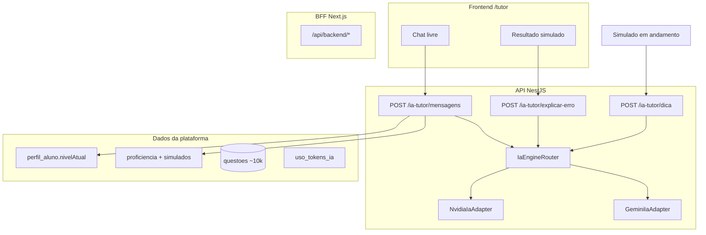

# Tutor IA — Tipos de pergunta, capacidades e endpoints

> O que o aluno pode perguntar, o que já funciona hoje, o que depende só do Gemini (conhecimento geral) e o que **exige endpoint + dados da plataforma**.

**Relacionado:** [ESCOPO-PRODUTO.md](./ESCOPO-PRODUTO.md) · [ESCOLHA-MODELO-IA.md](./ESCOLHA-MODELO-IA.md) · [WORKSPACE-UI-OSMO.md](./WORKSPACE-UI-OSMO.md)

**Modelo atual:** `IA_PROVIDER=nvidia` → `meta/llama-3.1-8b-instruct` (fallback: Gemini `gemini-2.5-flash`)

---

## Como o tutor funciona hoje



| Endpoint | Status | O que envia para o Gemini |
|----------|--------|---------------------------|
| `POST /ia-tutor/mensagens` | ✅ Funcionando | Pergunta livre + histórico + nível + **métricas reais** |
| `POST /ia-tutor/explicar-erro` | ✅ Funcionando | Enunciado, alternativas, gabarito (pós-simulado) |
| `POST /ia-tutor/dica` | ✅ Funcionando | Dica pedagógica **sem gabarito** (durante simulado) |
| `GET /ia-tutor/tokens` | ✅ Funcionando | Saldo diário de tokens IA |
| `POST /simulados/gerar-com-ia` | ✅ Funcionando | IA interpreta pedido → filtros → sorteia questões |
| `GET /ia-tutor/conversas` | ✅ Funcionando | Lista conversas do aluno (Postgres) |
| `GET /ia-tutor/conversas/:id` | ✅ Funcionando | Histórico completo de uma conversa |
| `POST /ia-tutor/conversas` | ✅ Funcionando | Criar conversa (ex.: após explicar erro) |
| `POST /ia-tutor/anexos/presign` | ✅ Funcionando | Foto → storage local (dev) ou S3 (prod) → vision Gemini |

---

## Matriz: tipo de pergunta × preparação

Legenda:

| Símbolo | Significado |
|---------|-------------|
| ✅ | Pronto hoje (chat livre ou endpoint existente) |
| 🌐 | Gemini responde com conhecimento geral (como “buscar na internet”) — **sem dados do seu banco** |
| 🔌 | Precisa **endpoint + dados reais** da plataforma para resposta confiável |
| ⬜ | Ainda não implementado |

### 1. Dúvidas de conteúdo (ENEM)

| Pergunta do aluno | Exemplo | Status | Como responde |
|-------------------|---------|--------|---------------|
| Explicar conceito | “O que é função do 2º grau?” | ✅ 🌐 | `POST /ia-tutor/mensagens` |
| Passo a passo de exercício | “Como resolver equação do 2º grau?” | ✅ 🌐 | Chat livre |
| Diferença entre conceitos | “Diferença entre mitose e meiose?” | ✅ 🌐 | Chat livre |
| Dica de estudo por tema | “Como estudar interpretação de texto?” | ✅ 🌐 | Chat livre + `nivelAtual` no prompt |
| Resumo de matéria | “Resume logaritmos para o ENEM” | ✅ 🌐 | Chat livre |
| Fórmula / regra | “Fórmula de Bhaskara” | ✅ 🌐 | Chat livre (prompt pede não inventar fatos) |

> **Limitação:** respostas vêm do treinamento do Gemini, não de um “professor oficial INEP”. Podem haver imprecisões — adequado para TCC com aviso ao aluno.

---

### 2. Questões e simulados (dados do banco)

| Pergunta do aluno | Exemplo | Status | Endpoint necessário |
|-------------------|---------|--------|---------------------|
| Explicar erro em questão que acertou/errou | “Por que errei a questão 5?” | ✅ | `POST /ia-tutor/explicar-erro` + botão no resultado |
| Mostrar questão específica | “Me mostra a questão de 2022 de matriz” | 🔌 ⬜ | `GET /questoes/:id` + UI ou contexto no chat |
| Gerar simulado por comando | “Quero 10 questões de natureza” | 🔌 ⬜ | `POST /simulados` (já existe; falta atalho no tutor) |
| Gabarito durante simulado em andamento | “Qual a resposta da 3?” | ❌ Bloqueado | Regra de negócio: não revelar gabarito antes de finalizar |

---

### 3. Estatísticas e “o que mais cai no ENEM”

| Pergunta do aluno | Exemplo | Status | Por quê |
|-------------------|---------|--------|---------|
| Assuntos que mais caem (geral) | “O que mais cai de matemática no ENEM?” | 🌐 ⚠️ | Gemini **chuta** com base em conhecimento geral — **não** analisa suas ~10k questões |
| Assuntos que mais caem (**seus dados**) | “No banco da plataforma, o que mais cai?” | 🔌 ⬜ | Precisa `GET /metricas/frequencia-temas` ou agregação em `questoes` |
| Meus erros por área | “Onde eu mais erro?” | 🔌 ⬜ | `GET /metricas/proficiencia` + `GET /metricas/lacunas` (S4) |
| Evolução no tempo | “Melhorei em matemática?” | 🔌 ⬜ | `GET /metricas/evolucao` (S4) |
| Comparar com média / meta | “Estou pronto para 700 em MT?” | 🔌 ⬜ | Modelo de proficiência + histórico de simulados |

> **Importante:** perguntas como *“assuntos que mais caem baseado em todos os ENEM”* **parecem** precisar do banco, mas hoje o tutor só usa Gemini — a resposta é educativa/genérica, não uma análise estatística do seed.

---

### 4. Trilha e plano de estudo personalizado

| Pergunta do aluno | Exemplo | Status | Endpoint necessário |
|-------------------|---------|--------|---------------------|
| O que estudar esta semana | “Monta minha semana de estudos” | 🔌 ⬜ | `GET /metricas/lacunas` + prompt com lacunas reais |
| Simulado focado na fraqueza | “Quero simulado só de física” | 🔌 ⬜ | `POST /simulados` com filtro + lacunas (S4) |
| Tempo diário sugerido | “Quantas horas por dia?” | ✅ 🌐 | Chat livre (pode usar `tempoDiarioMinutos` do perfil no futuro) |

---

### 5. Conta, planos e tokens

| Pergunta do aluno | Exemplo | Status | Endpoint necessário |
|-------------------|---------|--------|---------------------|
| Quantos tokens IA restam | “Posso mandar mais mensagens?” | 🔌 🟡 | `GET /usuarios/plano` (parcial: badge após 1ª msg) |
| Diferença Gratuito vs Apoio | “O que ganho no plano pago?” | ✅ 🌐 | Chat livre ou `/planos` |
| Upgrade de plano | “Quero assinar” | ⬜ | Checkout Mercado Pago (S5) |

---

### 6. Imagem e redação

| Pergunta do aluno | Exemplo | Status | Endpoint necessário |
|-------------------|---------|--------|---------------------|
| Foto de questão no caderno | [anexo JPEG] “Explica essa questão” | ⬜ | `POST /ia-tutor/anexos/presign` + vision |
| Foto da resolução | [anexo] “Onde errei?” | ⬜ | Presign + vision |
| Corrigir redação ENEM (competências) | Texto da dissertação | ⬜ | Fora do MVP (ESCOPO-PRODUTO) |

---

### 7. Metalinguagem / uso da plataforma

| Pergunta do aluno | Exemplo | Status |
|-------------------|---------|--------|
| Como criar simulado | “Como faço um simulado?” | ✅ 🌐 (orientação textual) |
| O que é ENEM+ | “O que essa plataforma faz?” | ✅ 🌐 |
| Suporte técnico | “Deu erro 404” | ✅ 🌐 (limitado; melhor FAQ humano) |

---

## Resumo executivo

| Categoria | Hoje | Próximo passo |
|-----------|------|---------------|
| Dúvida livre de conteúdo ENEM | ✅ Chat | Manter prompt + rate limit |
| Explicar erro pós-simulado | 🔌 Backend ✅, UI ⬜ | Botão no `/resultado` → `explicar-erro` |
| Estatísticas reais do banco | ⬜ | S4: agregar `questoes` + `respostas_simulado` |
| Trilha personalizada | ⬜ | S4: `GET /metricas/lacunas` injetado no prompt |
| Foto no chat | ⬜ | Presign R2 + Gemini vision |
| Histórico persistente | ⬜ | `conversas` + `mensagens` no Postgres |

---

## Endpoints a implementar (roadmap tutor)

### Prioridade alta (fechar E3)

| # | Endpoint | Para quê |
|---|----------|----------|
| 1 | `POST /ia-tutor/explicar-erro` no frontend | Erro do simulado → tutor com contexto |
| 2 | `GET /usuarios/plano` | Tokens restantes no `PlanBadge` ao abrir app |

### Prioridade média (dados reais, não só Gemini)

| # | Endpoint | Perguntas que passam a responder com **dados reais** |
|---|----------|------------------------------------------------------|
| 3 | `GET /metricas/frequencia-temas?area=matematica` | “O que mais cai em MT no nosso banco?” |
| 4 | `GET /metricas/lacunas` | “Minhas 3 maiores fraquezas” |
| 5 | `GET /metricas/proficiencia` | “Como está minha nota por área?” |
| 6 | `POST /ia-tutor/contexto` (opcional) | Injetar lacunas + último simulado no system prompt |

### Prioridade média (vision)

| # | Endpoint | Para quê |
|---|----------|----------|
| 7 | `POST /ia-tutor/anexos/presign` | Upload foto → R2 |
| 8 | `POST /ia-tutor/mensagens` com `anexoUrl` | Vision no Gemini |

### Prioridade baixa (pós-TCC)

| # | Endpoint | Para quê |
|---|----------|----------|
| 9 | `GET/POST /ia-tutor/conversas` | Histórico entre dispositivos |
| 10 | `POST /ia-tutor/corrigir-redacao` | Redação ENEM (competências) |

---

## Exemplo: “assuntos que mais caem em matemática”

### Hoje (só Gemini)

```
Aluno → POST /ia-tutor/mensagens
      → Gemini responde com conhecimento geral (aproximação, não estatística do seed)
```

**Resposta esperada:** lista típica (funções, geometria, estatística básica, etc.) — útil, mas **não calculada** sobre as 9.924 questões do Postgres.

### Futuro (com endpoint S4)

```
Aluno → POST /ia-tutor/mensagens
API   → GET /metricas/frequencia-temas?area=MATEMATICA
      → Monta prompt: "Com base nestes dados: { topTags: [...] }, explique..."
      → Gemini interpreta os números reais
```

**Implementação sugerida:**

1. Migration: campo `tags` ou `topico` em `questoes` (ou inferir por disciplina/índice).
2. `GET /metricas/frequencia-temas` — `GROUP BY` área + tag, `COUNT`, anos opcionais.
3. Use case `ResponderComContextoMetricasUseCase` — só quando detectar intenção (“mais cai”, “frequência”, “estatística”).

---

## Limites e avisos ao aluno (recomendado na UI)

- O tutor **não substitui** professor nem material oficial do INEP.
- Perguntas sobre **estatísticas do ENEM** sem endpoint dedicado são **orientativas**, não baseadas no banco da plataforma.
- **Tokens diários** limitam uso (plano gratuito).
- **Gabarito** de simulado em andamento não é revelado pelo tutor.

---

## Testes manuais rápidos

```bash
# API rodando em :3333, logado no front

# 1. Chat livre
POST /ia-tutor/mensagens
{ "mensagem": "Me explica logaritmos de forma simples" }

# 2. Explicar erro (precisa questaoId real do banco)
POST /ia-tutor/explicar-erro
{
  "questaoId": "<uuid>",
  "alternativaMarcada": "C",
  "perguntaExtra": "Por que não é a letra A?"
}
```

---

## Changelog

| Data | Alteração |
|------|-----------|
| 06/08/2026 | Documento criado; modelo `gemini-3.5-flash`; matriz pergunta × endpoint |
